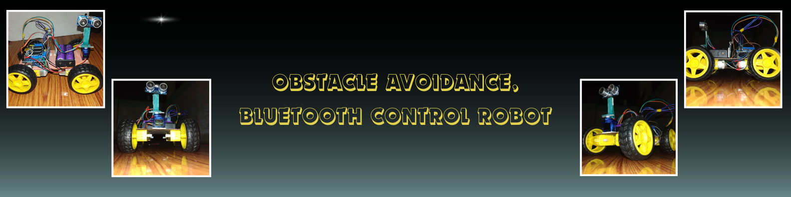

# 🤖 Smart Rover - The Obstacle Avoidance & Bluetooth Control Robot

**Smart Rover** is an Obstacle Avoidance & Bluetooth Control Robot designed to navigate environments autonomously, avoiding obstacles using ultrasonic sensors. It can also be remotely controlled and monitored via Bluetooth, integrating IoT capabilities for real-time operation.

## 📋 Features

-  **Autonomous Navigation**: Detects obstacles and automatically navigates around them.
-  **Remote Control**: Bluetooth connectivity allows for manual control via a mobile app.
-  **IoT Capabilities**: Provides remote monitoring and control.
-  **Portable Design**: Lightweight and powered by rechargeable Li-Ion batteries.

## Technologies Used

- **C++** - Programming language for Arduino control.
- **IoT** - Bluetooth integration for remote access.

## Components & Tools

- **Arduino Uno** - Microcontroller board
- **Ultrasonic Sensor (HC-SR04)** - For obstacle detection
- **Servo Motor** - For controlling direction
- **Arduino L293D Motor Driver Shield** - For motor control
- **DC Motors (4)** - Powering the wheels
- **Wheels (4)** - Robot movement
- **Chassis (Lightweight Cardboard)** - Body frame
- **2200 mAh Rechargeable Li-Ion Battery (2)** - Power source
- **Li-Ion Battery Charger** - For recharging batteries
- **Bluetooth Module (HC-05)** - Remote communication
- **Jumper Wires** - For circuit connections
- **Electric Switch** - On/off control
- **USB Cable** - For programming the Arduino
- **Mobile Phone**- For remote control

## Project Approach

### 1. Circuit Design

- Connect the ultrasonic sensors, motor driver, and Bluetooth module to the Arduino.

### 2. Programming the Arduino

- Write the C++ code to read sensor data and control the motors.

### 3. IoT Integration

- Set up the Bluetooth module for remote control and monitoring using a mobile application.

##  Circuit Diagram

## 📚 References

- [Arduino Documentation](https://www.arduino.cc/en/Guide/HomePage)
- [Ultrasonic Sensor (HC-SR04)](https://components101.com/sensors/ultrasonic-sensor-working)
- [Bluetooth Module (HC-05)](https://components101.com/wireless/hc-05-bluetooth-module)

**If you like this project, please consider giving it a ⭐!**
⬆️ **[Back to Top](./assets/banner.png)**

